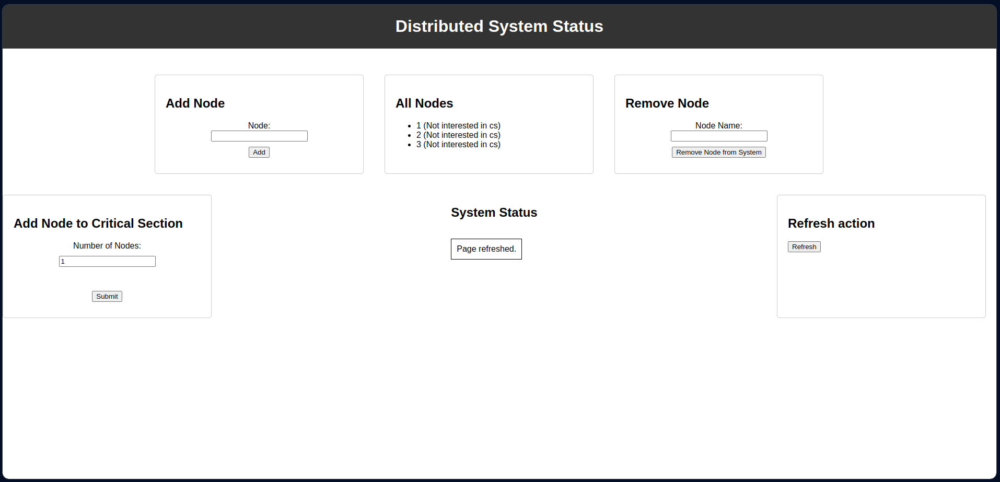
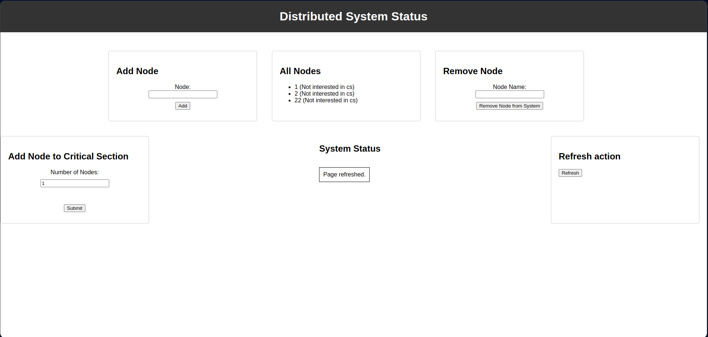

# Ricart_Agarawala DS\n\n# Implementing Ricart Agrawala in Python

## Instructions

cd Web_App

python3 app.py

Open browser and Navigate to localhost:5000/. You will see this: [Home Page](http://127.0.0.1:5000/)

In [Display_Files](http://127.0.0.1:5000/display_files) we can see Status of Nodes

